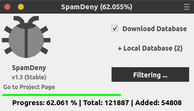

# SpamDeny

**v1.2 : _Beta_**


> **_Tested_**

- Python    : 3.6
- OS        : Debian, Ubuntu, Mint


> **_Requirements_**

- Python    : 3.6
- PyQt      : 5


> ## Documentation

#### _For Library_
```python
from SpamDeny import *

sd = SpamDeny()

# Add Local Data
sd.local=[
	'/path/to/file1',
	'/path/to/file2'
]

# To Download Files
sd.download()

sd.filter()
```


#### _For Gui_ (Cross Platform)
```shell
# 1. Clone / Download Repository & Extract
# 2. Open Console & Follow Download Location
python3 Start.py
```




#### Gui Usage
- `Download Database` is to download from Database providers.
- `Local Database` is to add your own databases in `txt` file. Separate IP by new line. Multiple files supported.
- `Generate` is to generate & filter IPs & save files in desktop.


> ### Server Config Files

##### _Files will be generate on Desktop_

#### Nginx
- Copy `blockips.conf` Inside `/etc/nginx/conf.d/`
- Open `nginx.conf` insert `include /etc/nginx/conf.d/*.conf;` in `http` section. (If not exists.)

#### Apache
- Copy `denyips.conf` Inside `etc/apache2/sites-access/`
- Open **Server Block** e.g. `sites-enabled/site.conf` insert `Include /etc/apache2/sites-access/denyips.conf` in `VirtualHost` section. 


> **_Contributors_**

#### Ip Database
https://www.stopforumspam.com

https://www.stopforumspam.com/contributors


> **_Note_**

- Report here for issue / bug.
- Let me know to become a contributor.


> ## _License (C) 2019 under GNU GPL V2_

