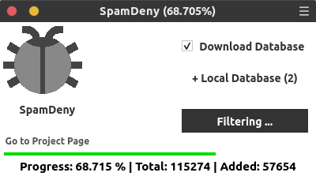

# SpamDeny
**v1.6 : _Stable_**


> ### _Tested on_

Debian, Ubuntu, Mint, Windows 7, Windows 10


> ### _Requirements_

- Python  >= 3.6.5  (Full Install with System Path/Environment)
- PyQt    == 5
- requests
- pywin32           (Only For Windows)


> ## _Documentation_

**_For Library_**
```python
from SpamDenyLib import *

# Create Object #
sd = SpamDeny()

# Add Local Data #
sd.local=[
	'/path/to/file1',
	'/path/to/file2'
]

# To Download Database #
sd.download()

# Start Filter & Generate #
sd.filter()
```


**_For Gui_** (Cross Platform) 
```shell
'''
1. Clone / Download Repository & Extract
2. Open Console & Follow Download Location
3. Run command below
'''
python Start.py
```

**_Gui only for Windows Users_**

1. Download ZIP & Extract.
2. Download & install Python 3.6.8 with System Path. (Skip, if already installed)
3. Double click on `Start.py`.




> ### _Gui Usage_

- `Download Database` is to download from Database providers.
- `Local Database` is to add your own databases in `.txt,csv` file. Separate IP by new line. (Multiple files support)
- `Generate` is to filter IPs & generate/save files in `Desktop`.


> ### _Server Config Files_

**Files will be generate on Desktop**

**_Nginx_**
- Copy `blockips.conf` Inside `/etc/nginx/conf.d/`
- Open `nginx.conf` insert `include /etc/nginx/conf.d/*.conf;` in `http` section. (If not exists.)


**_Apache_**
- Copy `denyips.conf` Inside `etc/apache2/sites-access/`
- Open **Server Block** e.g. `sites-enabled/site.conf` insert `Include /etc/apache2/sites-access/denyips.conf` in `VirtualHost` section. 


> ## _Contributors_

#### Ip Database
- https://www.stopforumspam.com
- https://www.stopforumspam.com/contributors


> ## _Note_

- If first time you are using this tool, check the requirements has installed.
- Report here for issue / bug.
- Let me know to become a contributor.


> ## _License (C) 2019 under GNU GPL V2_
